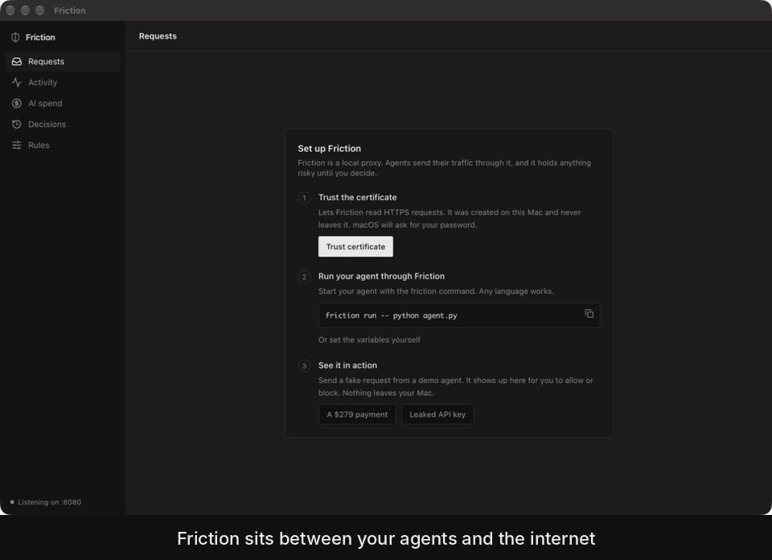

# Friction

A local firewall and flight recorder for AI agents on macOS.



```sh
friction run -- python agent.py
```

Agents that write code, browse and run tools can spend your money, leak your keys and burn through API credit in a loop. Friction sits between your agents and the internet, records everything they send, and stops the things that matter until you say yes.

Everything runs on your Mac. No account, no cloud, no telemetry.

## What it does

**Asks before any payment.** Requests to Stripe, PayPal, Square, Adyen, Braintree, Shopify checkout, Coinbase, Wise, Plaid, Paddle, Lemon Squeezy and Alpaca are held until you allow them, with the amount read straight from the request when it's there ("Stripe payment for $20.00"). Optionally, POSTs to checkout, payment and purchase paths on any other site are held too.

**Stops leaked secrets.** API keys (AWS, OpenAI, Anthropic, GitHub, Stripe, Slack, Google, Hugging Face, npm), private keys and `.env` values are caught in request bodies and URLs, unless they're going to their own service. Your Anthropic key going to Anthropic is fine; the same key in a pastebin upload is not. Secrets are masked in everything Friction shows or saves.

**Meters and caps AI spend.** Calls to OpenAI, Anthropic, Google, OpenRouter, Azure OpenAI, DeepSeek, Mistral, xAI and others are metered from the real token counts in each response, streamed or not. Set a daily limit (overall or per agent) and Friction cuts the agent off when it's reached.

**Records everything.** Activity shows every request every agent made: method, host, status, size, timing, tokens and cost, with full headers and bodies one click away. Export to HAR for Chrome DevTools, Charles or Proxyman.

Held requests show exactly what the agent is sending. Allow with ⌘↩, block with ⌘⌫. No answer in two minutes, or the agent hangs up, means blocked.

## Install

Download `Friction_0.1.0_universal.dmg` from Releases (Apple Silicon and Intel), drag Friction to Applications, and open it.

> The app isn't notarized yet. On first launch macOS will refuse to open it; go to System Settings → Privacy & Security and click "Open Anyway".

## Set up

1. **Trust the certificate.** Friction creates its own certificate authority on first launch (`~/.friction/friction-root-ca.pem`) so it can read HTTPS. The private key is generated on your Mac, stays there with `0600` permissions, and is unique to your install.
2. **Run your agent through Friction.** Install the command from *Rules → Connection*, then:

   ```sh
   friction run -- python agent.py
   friction run --name researcher -- node agent.js   # label it
   eval "$(friction env)"                             # or configure the current shell
   ```

   `friction run` sets the proxy variables and a CA bundle (macOS system roots plus your Friction CA) for Node, Python, curl, git, Cargo, pip, Deno and the AWS CLI.
3. **Try it.** Click *A $279 payment* or *A leaked API key* in the app, or run `friction demo`. Neither leaves your Mac.

## rules.toml

`~/.friction/rules.toml` is created on first launch with every option commented out. Anything set there overrides the app's settings, and changes apply as soon as you save. A broken file keeps your last good rules and tells you which line is wrong.

```toml
[budget]
daily_ai_spend = 10.0          # USD across all agents

[[block]]
host = "*.pastebin.com"

[[hold]]
method = "DELETE"
host = "api.github.com"
reason = "Deleting on GitHub"

[[allow]]                      # never hold (secrets are still caught)
method = "POST"
host = "api.stripe.com"
agent = "billing-bot"

[agents.researcher]
daily_ai_spend = 2.0

[[ai_endpoint]]                # meter an internal gateway or self-hosted server
host = "llm.internal.example"

[pricing."my-finetune"]        # USD per 1M tokens
input = 3.0
output = 15.0
```

Rule packs are plain TOML, so they're easy to share.

## How it works

Friction is a [Tauri](https://tauri.app) app: a React UI over a Rust proxy (hyper + rustls) on `127.0.0.1:8080`, or the next free port if something else has 8080.

- HTTPS `CONNECT` tunnels are terminated with a per-host certificate signed by your local CA, inspected, then re-encrypted to the real server with the standard WebPKI roots.
- Clean requests are forwarded untouched and responses stream back unbuffered. A tap keeps the first and last bytes of each response for token accounting and Activity.
- Held requests wait on a channel until you decide; nothing is sent upstream before that.
- Settings, history, spend and (optionally) bodies live in `~/.friction/`.

Closing the window doesn't stop Friction. It keeps running in the menu bar until you quit. macOS 11 or later; HTTP/1.1 to the agent.

## Build from source

Requires Rust (stable), Node 20.19+ and Xcode Command Line Tools.

```sh
npm install
npm run tauri -- build            # release .app and .dmg
npm run tauri -- dev              # development with hot reload
```

`scripts/proxy-test.sh` runs end-to-end checks against a running app (it uses a local mock AI server, `scripts/mock-ai-server.py`, to test spend metering).

## Privacy

Friction makes no network requests of its own. There is no analytics.

## License

MIT
